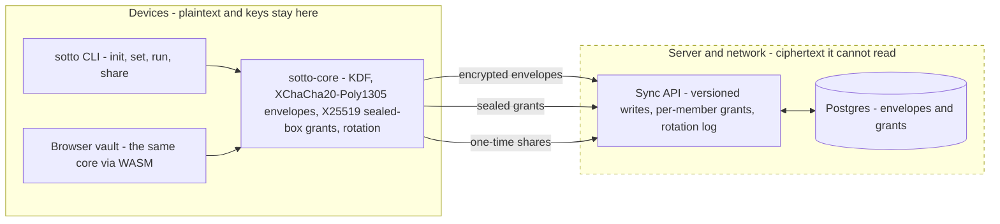

# Sotto

End-to-end encrypted secret sync for developer teams. Stop Slacking your `.env`.

> [!WARNING]
> Sotto is pre-1.0 and has not had a third-party cryptographic audit.
> See [SECURITY.md](https://github.com/getsotto/sotto/blob/main/SECURITY.md).

## How it fits together

Everything left of the dashed boundary holds keys and plaintext. Everything
right of it only ever sees ciphertext - including the database if stolen.

## Pick your path

| I want to… | Start here |
| --- | --- |
| Use Sotto | `curl -fsSL https://raw.githubusercontent.com/getsotto/sotto/main/install.sh \| sh`, then the [quick start](https://github.com/getsotto/sotto#quick-start) |
| Contribute | [CONTRIBUTING.md](https://github.com/getsotto/sotto/blob/main/CONTRIBUTING.md), then a [good first issue](https://github.com/getsotto/sotto/labels/good%20first%20issue) |
| Self-host | One-command deploy in [deploy/README.md](https://github.com/getsotto/sotto/blob/main/deploy/README.md) |

## Repositories

| Repo | What it is |
| --- | --- |
| [sotto](https://github.com/getsotto/sotto) | CLI, sync server, web client, and the shared crypto core |
| [sotto-action](https://github.com/getsotto/sotto-action) | Install the CLI in GitHub Actions |

Security model in 30 seconds

- Zero knowledge sync: the server sees ciphertext plus minimal metadata, never plaintext or usable keys.
- Teams: organisations with roles, per-member environment grants, key rotation on member removal, machine tokens for CI, lost key recovery.
- Honest limits: metadata exposure, pre transparency key directory, and the weaker assurance of the served browser client are all documented in [THREAT-MODEL.md](https://github.com/getsotto/sotto/blob/main/THREAT-MODEL.md).
- Report vulnerabilities privately per [SECURITY.md](https://github.com/getsotto/sotto/blob/main/SECURITY.md), never as a public issue.

First contribution in 5 minutes

1. Fork and clone [sotto](https://github.com/getsotto/sotto).
2. Pick a [good first issue](https://github.com/getsotto/sotto/labels/good%20first%20issue) - docs and CLI help-text issues need no cryptography knowledge.
3. Sign off every commit with `git commit -s` (Developer Certificate of Origin).
4. Questions that are not bugs belong in [Discussions](https://github.com/getsotto/sotto/discussions).

